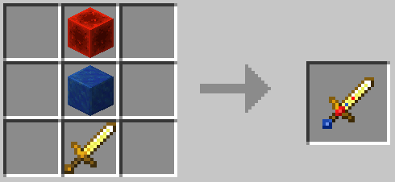

# Tatwi's Minecraft Bedrock Mod Pack

A collection of minor adjustments and additions to enhance the aspects of the game that I enjoy.  

## Requirements

- Minecraft Bedrock Edition.  
- To accommodate new items, Holiday Creator Features must be enabled under Experiments.  

## New Items

**Empty Milk Bottle**  
- Used for creating bottles of milk from a bucket of milk.

**Bottle of Milk**   
- Same effect as a normal bucket of milk when consumed.  
- Stacks up to 16.  
- Does not return bottle when used.  

**Bottle of Chocolate Milk**  
- Grants Speed I and Jump Boost I for 16 seconds when consumed.  
- Stacks up to 16.  
- Does not return bottle when used.  

**Bottle of Apple Juice**  
- Grants Regeneration II and Speed I for 6 seconds when consumed.  
- Stacks up to 16.  
- Does not return bottle when used.  

**Gross**  
- It's so disgusting that you'll hardly even notice it comes in a bottle!
- Grants Haste I, Absorption I, and Slowness II for 32 seconds when consumed.  
- Stacks up to 16.  
- Does not return bottle when used.  

**Bottle of Fruit Punch**  
- Grants Strength I and Absorption I for 16 seconds when consumed.  
- Stacks up to 16.  
- Does not return bottle when used.  

**Fun Swords**  
  
- 8 new swords with unique appearances and identical functionality.  
- Bedazzled Blade, Crystal Blade, Magma Blade, Prismarine Blade, Sword of Dreams, Sword of Seasons, Sword of Stars, Sword of Whimsy.  
- Damages like a Stone Sword (5).  
- Enchants like an Iron sword.  
- Has bonus durability (333).  

## New Recipes

**Awkward Potion**  
- Rotten Flesh + Bottle of Water  

**Potion of Weakness**  
- Poisonous Potato + Awkward Potion  

**Empty Milk Bottle**  
  
- 5 Glass = 1 Empty Milk Bottle  

**Bottle of Milk**  
  
- 1 Bucket of Milk + 4 Empty Milk Bottles = 4 Bottles of Milk  

**Bottle of Chocolate Milk**  
  
- 1 Bucket of Milk + 4 Empty Milk Bottles + 1 Sugar + Cocoa Beans = 4 Bottles of Chocolate Milk  

**Bucket of Milk**  
  
- 1 Empty Bucket + 4 Bottles of Milk = 1 Bucket of Milk

**Black Dye**  
  
- 1 Slimeball + 1 Coal = 1 Black Dye  

**Blaze Powder**  
  
- 5 Gunpowder + 4 Flint = 4 Blaze Powder  

**Ink Sac**  
  
- 1 Glow Ink Sac + 1 Black Dye = Ink Sac  

**Leather**  
  
- 1 Rotten Flesh + 1 Bone Meal = 1 Leather  

**Transmute Copper to Gold**  
  
- 8 Copper Ingots + 1 Redstone Dust = 6 Gold Ingots  

**Transmute Emerald to Diamond**  
  
- 1 Emerald + 4 Obsidian + 4 Gunpowder = 1 Diamond  

**Chainmail Boots**  
  
- 2 Copper Ingots + 2 Wool = 1 Chainmail Boots  

**Chainmail Chestplate**  
  
- 5 Copper Ingots + 3 Wool = 1 Chainmail Chestplate  

**Chainmail Helmet**  
  
- 2 Copper Ingots + 3 Wool = 1 Chainmail Helmet  

**Chainmail Leggings**  
  
- 3 Copper Ingots + 4 Wool = 1 Chainmail Leggings  

**Bottle of Apple Juice**  
  
- 4 Apples + 1 Empty Milk Bottle = 1 Bottle of Apple Juice

**Gross**  
  
- 4 Cactus + 2 Kelp + 1 Sugar + 1 Sea Pickle + 1 Empty Milk Bottle = 1 Gross

**Bottle of Fruit Punch**  
  
- 2 Beetroot + 1 Sweet Berry + 1 Glow Berry + 1 Empty Milk Bottle = 1 Bottle of Fruit Punch

**Bedazzled Blade**
  
- 1 Golden Sword + Block of Redstone + Block of Lapis Lazuli = 1 Bedazzled Blade  

**Crystal Blade**
  
- 1 Golden Sword + Block of Amethyst + Polished Diorite = 1 Crystal Blade  

**Magma Blade**
  
- 1 Golden Sword + Magma Block + Black Glazed Terracotta = 1 Magma Blade  

**Prismarine Blade**
  
- 1 Golden Sword + Prismarine + Dark Prismarine = 1 Prismarine Blade  

**Sword of Dreams**
  
- 1 Golden Sword + Block of Emerald + Green Glazed Terracotta = 1 Sword of Dreams  

**Sword of Seasons**
  
- 1 Golden Sword + Honeycomb Block + Mossy Cobblestone = 1 Sword of Seasons  

**Sword of Stars**
  
- 1 Golden Sword + Calcite + Smooth Basalt = 1 Sword of Stars  

**Sword of Whimsy**
  
- 1 Golden Sword + Red Mushroom Block + Tuff = 1 Sword of Whimsy  

## Modified Recipes

## Modified Items

**Soup, Stew, & Bowls**  
- Beetroot Soup, Mushroom Stew, and Rabbit Stew stack to 16 and no longer return the bowl when used.

# Credits

I extend my thanks to the volunteers who created and continue to update [Bedrock Wiki](https://wiki.bedrock.dev/),   [Blockbench](https://www.blockbench.net/),  [bridge.](https://bridge-core.github.io/), [Geany](https://www.geany.org/), [GIMP](https://www.gimp.org/), and [Minecraft Wiki](https://minecraft.fandom.com/wiki/Minecraft_Wiki). Without your efforts, mods would be far too much of a convoluted nightmare to bother with!